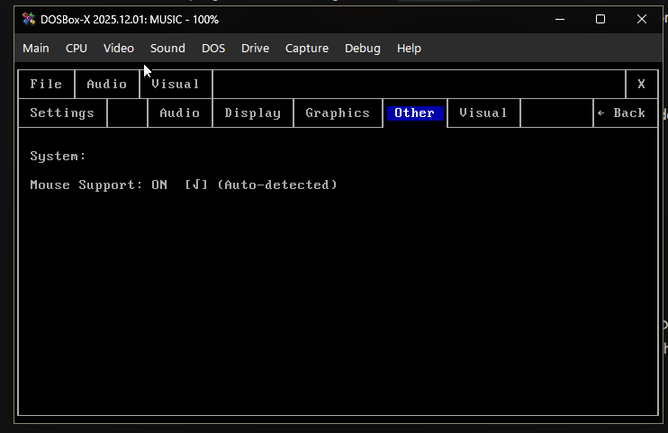

# Dos-music-player
Dos-music-player is an audio/music player inspired by MPX Play and Windows Media Player, built entirely from scratch in C++, compiled with DJGPP, and with the help of Google Gemini for classic MS-DOS environments. It brings a modern, Windows-like GUI experience into a pure 80x25 text-mode terminal. Yes, I know that the whole program is made with the help of AI. Because I'm not good at coding at this level, I only know how to design the user interface, and I love a DOS and retro-futuristic aesthetic.

Main Screen with debug visualizer, running under DOSBox

Main Screen with Bars visualizer, running under DOSBox

Main Screen with VU Meter visualizer, running under DOSBox

Menus preview

  .    .  

# Settings page

Audio Settings

Graphics settings with theme settings

Visual settings

# Some preview screenshots with different theme setting applied

Other settings will be available in the later versions

Display settings will be available in the later versions
