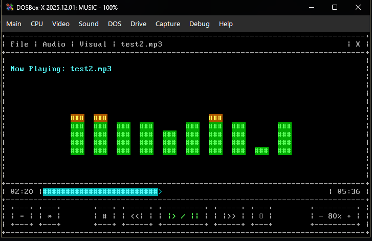

# Dos-music-player
Dos-music-player is an audio/music player inspired by MPX Play and Windows Media Player, built entirely from scratch in C++, compiled with DJGPP, and with the help of Google Gemini for classic MS-DOS environments. It brings a modern, Windows-like GUI experience into a pure 80x25 text-mode terminal. Yes, I know that the whole program is made with the help of AI. Because I'm not good at coding at this level, I only know how to design the user interface, and I love a DOS and retro-futuristic aesthetic.

## Minimum System Requirements

Main Screen with debug visualizer, running under DOSBox

Main Screen with Bars visualizer, running under DOSBox

Main Screen with VU Meter visualizer, running under DOSBox

Menus preview

  .    .  

# Features

Core Playback Engine

 - Dual-format audio support for MP3 (MPEG Audio) streaming and native WAV (Uncompressed PCM) playback.

 - Hardware-level Sound Blaster routing with support for SB16 and SB Pro 2.0 DSPs.

 - Motherboard PC Speaker overdrive engine using custom PWM timing for systems without dedicated sound cards.

 - 486 Transcoder Cache to dynamically decode MP3s into WAV files for playback on slower legacy CPUs.

 - Global playback controls including play, pause, stop, 5-second seeking, looping, and volume adjustment.

Custom VRAM Interface

 - Custom graphical window manager running natively in standard DOS 80x25 text mode.

 - Full mouse support for interacting with tabs, drop-down menus, and scrollbars.

 - Customizable UI themes with adjustable background, foreground, selection, and critical colors.
 
 - Toggleable ANSI and Extended ASCII drawing modes for maximum hardware compatibility.

Audio Visualization & Telemetry

 - Real-time "Frequency Bars" visualizer powered by live Fast Fourier Transform (FFT) math.

 - Dynamic VU Meter with customizable peak falloff speeds and multi-color warning zones.

 - Hardware Subsystem Telemetry dashboard displaying live IRQ hits, DMA buffer states, frame counts, and active sample rates.

Media & Queue Management

 - Integrated File Browser with directory navigation, text-based search filtering, and quick drive selection.

 - Comprehensive M3U playlist support allowing users to create, load, save, and modify track queues.

 - Advanced Media Info view with extensive ID3 tag parsing for Artist, Title, Album, Year, Genre, BPM, Composer, and Encoding data.

# Settings page

Audio Settings

Graphics settings with theme settings

Visual settings

Other settings will be available in the later versions

Display settings will be available in the later versions

# Some preview screenshots with different theme setting applied

Compatibility Ansi-only Mode

## Supported File Types

* **Audio:** `.mp3` (MPEG Audio), `.wav` (Uncompressed PCM)
* **Playlists:** `.m3u` (MP3 URL Playlists)

## Known Issues (v1.0)

1. **UI Flicker** users on slower systems (or running under heavy emulation) may notice slight flickering in the UI when moving the mouse or hovering over buttons. This is a known limitation caused by the heavy CPU load of the real-time Fast Fourier Transform (FFT) audio math competing with the custom VRAM window manager for processor cycles. This is also caused due to inefficient hover graphics processing.

2. **Slight Pitch Shift on Sound Blaster Pro 2.0 (Emulated)**
   When running the player under modern DOS emulators (like SBEMU) in strict Sound Blaster Pro 2.0 mode, audio may play at a slightly higher pitch (approx. 3-5% faster). This is caused by a mathematical conflict between how the original SB Pro hardware derived sample rates from its internal 1MHz crystal, and how modern emulators attempt to forcefully correct legacy Time Constants. 
   > **Workaround:** This issue does not affect real bare-metal DOS hardware, nor does it affect users running in Sound Blaster 16 mode.

## System Requirements
Recommended (Real-Time MP3 Streaming & Visualizers)
For flawless 44.1kHz stereo MP3 decoding while running the FFT visualizer and VRAM UI simultaneously:

 - OS: MS-DOS 5.0+, FreeDOS, or modern emulators (DOSBox, DOSBox-X, PCem)

 - CPU: Intel Pentium 90 MHz or faster (or equivalent AMD/Cyrix)

 - RAM: 8 MB

 - Audio: Sound Blaster 16 or 100% compatible

 - Video: VGA Compatible Graphics Card

 - Input: Microsoft Compatible Mouse (Serial or PS/2) and Standard Keyboard

Absolute Minimum (WAV / 486 Transcoder Mode)
Using native .wav files, or using the internal Transcoder Cache to pre-convert MP3s before playback:

 - OS: MS-DOS 5.0+ with a DPMI host (CWSDPMI, HDPMI32i)

 - CPU: Intel 80486 DX2-66 (A math coprocessor is highly recommended)

 - RAM: 4 MB

 - Audio: Motherboard PC Speaker (PWM Overdrive Mode) or Sound Blaster Pro 2.0

 - Video: VGA or MDA (Monochrome Display Adapter)
   
 - Input: Standard Keyboard and Microsoft Compatible Mouse (Serial or PS/2) [Mouse is required for changing settings]

# Tested on
DOS version 7.10 on DOSBox-X version 2025.12.01
DOS 6.22 on Real Hardware with sbemu driver (AMD Ryzen 3200g)
